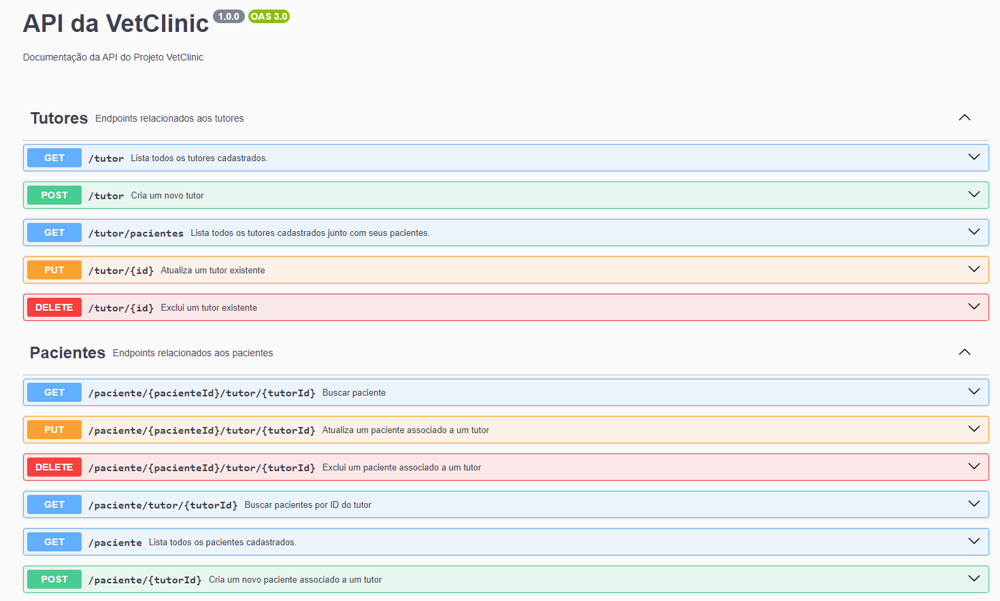

# VetClinic Project :dog:

This is a project for a fictional veterinary clinic, developed with TypeScript, Express.js, and TypeOrm.

## Description

The VetClinic Project is an application for managing owners and patients of a veterinary clinic. It allows the creation, updating, listing, and removal of owners and patients, and provides API documentation using Swagger.

## Technologies Used

- TypeScript@^5.4.5
- Express.js@^4.19.2
- TypeOrm@^0.3.20
- Prettier@^3.2.5
- Swagger-jsdoc@^6.2.8
- Swagger-ui-express@^5.0.0
- Eslint@^8.57.0
- Nodemon@^3.1.0
- Concurrently@^8.2.2

## Setup

1. **Dependency Installation:**

   Before starting the project, make sure to install all necessary dependencies. You can do this by running:

   ```bash
   npm install
2. **Database Configuration:**
   Ensure you properly configure the database in the .env file with the DB_PATH variable specifying the path to your database.
3. **Compile and Run TypeScript files:**
   To compile TypeScript files, run the following command. This will generate JavaScript files that your server can interpret and will also start the project:
   ```bash
   npm run dev
   ```
   The server will be available at http://localhost:3000.
   
## Usage
After starting the server, you can begin making requests to the API using tools like Postman or cURL. Refer to the Swagger documentation at http://localhost:3000/api-docs for information on the available endpoints and their parameters.

#### Example Command

```bash
In Postman, set your URL to POST http://localhost:3000/api/paciente/1
And add the following JSON to the Body - raw:

{
 "name": "Fidorento",
 "species": "Lakes Dog",
 "birthDate": "2023-10-30"
}
```

## Contribution :tiger:
Contributions are welcome! If you would like to contribute to this project, follow these steps:

Fork the repository
Create a new branch (git checkout -b feature/new-feature)
Commit your changes
Push to the branch (git push origin feature/new-feature)
Open a pull request